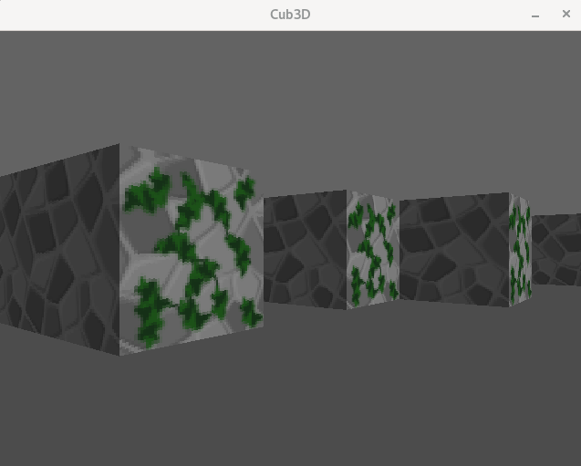
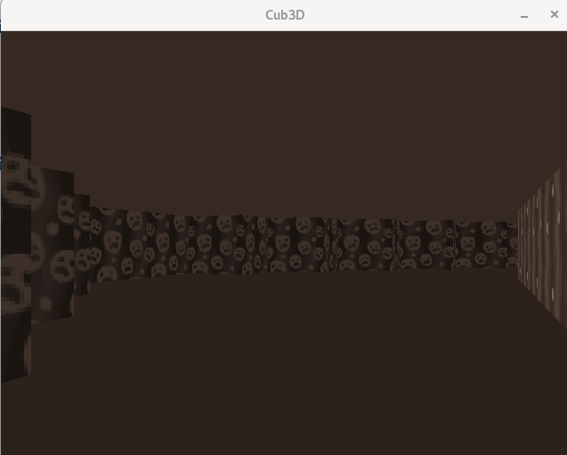

# Cub3d

🇫🇷

Le projet Cub3D consiste a créer un jeu 3D inspiré par Wolfenstein3D, le premier jeu de tir à la première personne (FPS).
Pour arriver a nos fins, nous utiliserons le __ray-casting__ et la MinilibX, la bibliotheque graphique de l'École 42.

Le code doit respecter la Norme imposée par 42 (voir pdf).

🇺🇸

The Cub3D project consists in creating a 3D game inspired by Wolfenstein3D, the first first person shooter (FPS).
To achieve our goals, we will use __ray-casting__ and MinilibX, the graphics library of School 42.

The code must respect the Norm imposed by 42 (see pdf).

# Screenshots

