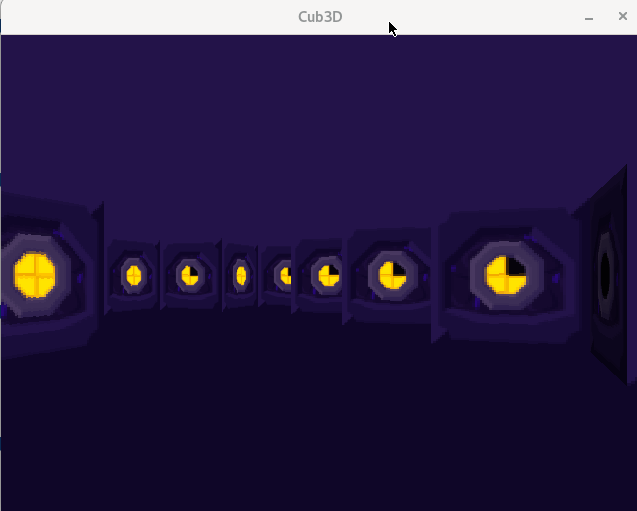
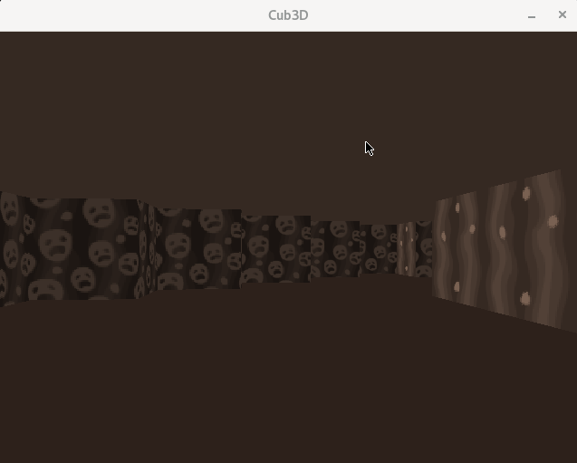
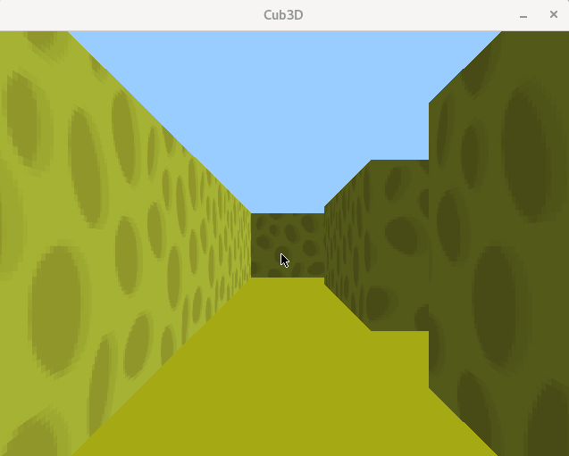

# cub3d

🇫🇷

Le projet Cub3D consiste a créer un jeu 3D inspiré par Wolfenstein3D, premier jeu de tir à la première personne (FPS).

Pour arriver a nos fins, nous utiliserons le __ray-casting__ et la MinilibX, la bibliotheque graphique de l'Ecole 42.

🇺🇸

